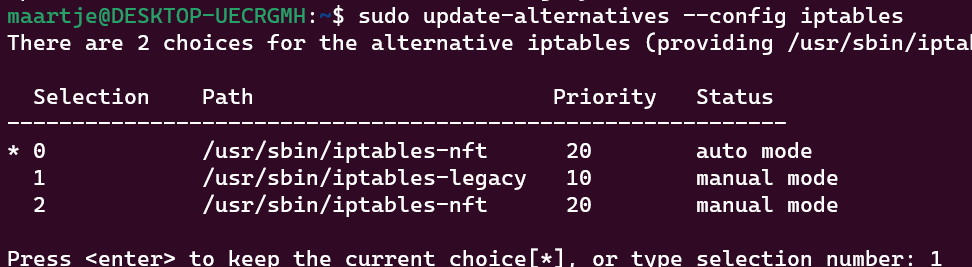
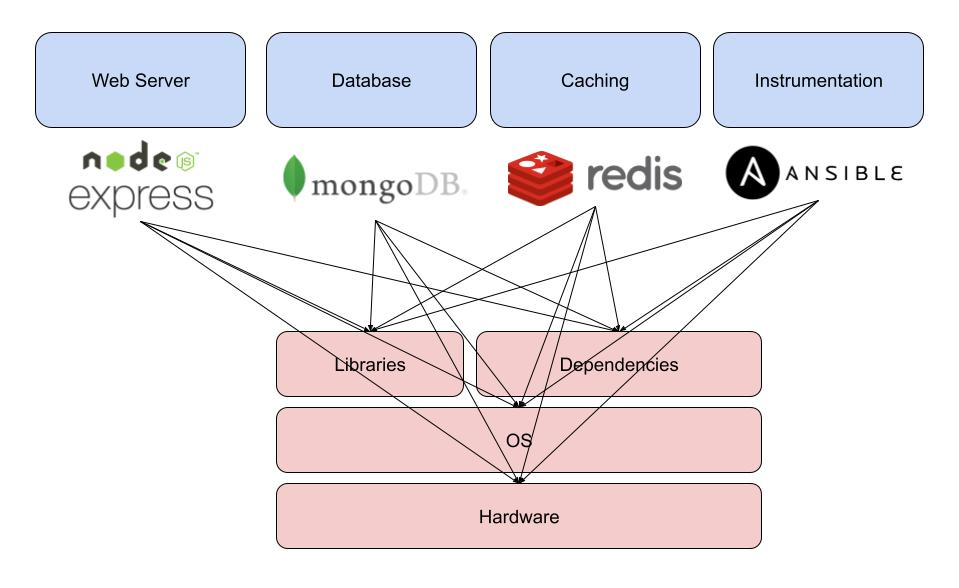
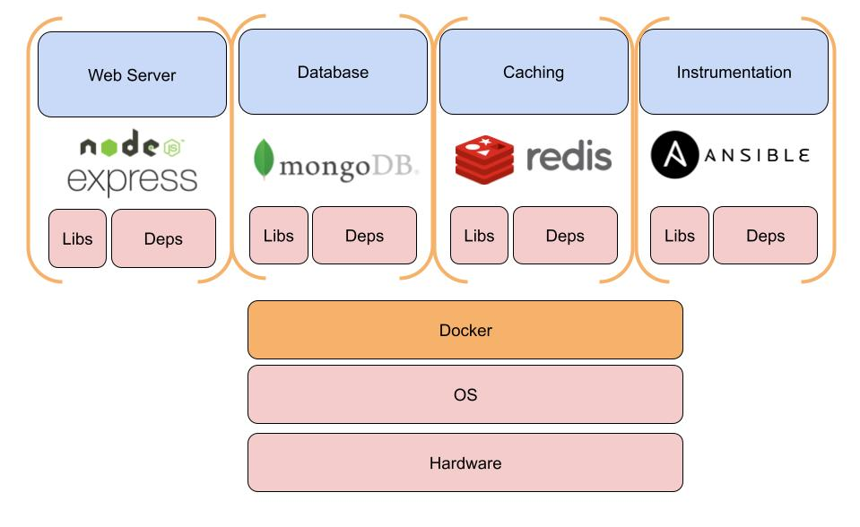

# Docker

> Docker is a computer program to virtualize the computer's file system.

This is what happens when you want to copy an introduction from Wikipedia. Let's not look at that for a moment.


> NOTE: As of late, Docker Hub limits the number of downloads per IP address. If examples do not work
> you can prefix `docker.stuvm.be/f/docker/`. This downloads a copy over the StuVM network.

Docker is often described as a PaaS tool. It's going to provide a platform for us to run our apps on. That's a rough idea of what Docker is.
Docker runs processes in an isolated container on our Linux system. It uses Linux "cgroups" and "namespaces." This allows us to use an entire Linux environment (or part of it) per application.


This diagram from Aqua Security shows it well where Docker is located by comparing it to a VM. Docker is often **erroneously** called a lightweight VM. However, this is not a correct term since no hardware is virtualized.

Docker shares the Linux kernel among different containers where a VM only shares hardware. So the isolation between 2 containers is less than between 2 VMs.
This has several advantages:

- Docker containers start instantly, no boot time
- Docker containers are light, they have no kernel
- Docker containers are resource less intensive they use only the necessary parts of the OS
- Docker containers are easier to reuse due to small footprint (no disk image!)
- Docker images are stateless

Note that this also impacts security, the isolation between 2 containers is not perfect!

## History

> **The Docker Myth**
> Sysadmin: your code does not work  
> Developer: works on my laptop!  
> Sysadmin: then send me your laptop for in the datacenter
>
> _And that kids is how Docker was born_

Containers are not new! While many attribute the invention to Docker and some call a reinvention by Docker a wrong term, containers have been around for a long time. Docker on the other hand changed how we treated them, seeing them no longer as mini-servers but as a building block of a larger whole.

Containers have their origins in the year 1999 but not in the Linux world. Jails were a feature in FreeBSD (Unix based) to be able to split a server into "virtual machines" that shared the FreeBSD kernel to avoid overhead. First ideas about this idea come as early as 1982 from `chroot`, but this isolation was minimal and limited to the file system.

(Hardware Virtualization existed experimentally since the 60s but had a great perfomance impact until Intel and AMD built in hardware support in 2005)

Linux containers made their appearance in 2005 with the so-called "VPS" a Virtual Private Server. The VPS offered a cheap solution for hosting servers, where before you had to rent an entire server you could now rent a part. Today we see that this has become the standard with cloud.
Today these are mostly VMs but in 2005 this was not optimal. OpenVZ (Virtuozzo as a commercial product) was still a fork of the Linux kernel to make this possible. Later in more recent Linux versions, LXC came with native support for containers.

Containers however were treated like VMs, they had heavy images and were maintained individually as if they were physical servers. Each Container had its own network stack, IP and even a name.

Docker saw a Linux Container not as a pet (= server with name and concerns) but as an individual service. As an isolated process on a server. Herein was the breakthrough for Docker in 2013. Containers solved problems around dependency management and application shipping. Containers were now of shorter lifespan, created quickly and container images could be created programmatically.

The technology that made it possible was already there, the concept of Docker newly born.

### Docker, Moby, Docker inc.

Docker in this course we talk about the technology Docker, more specifically to tool `docker`.
Docker started as an open source project of Docker Inc. However, it is now managed by the community under the name [Moby](https://www.mobyproject.org/). However, we are still using the tool from Docker Inc. which is a finished tool where Moby is the base and underlying technology.

Docker is still everywhere in the DevOps world. Docker Inc. does still exist in a lighter form.... The company had an early and huge success but failed to commercialize the product. They failed to win over the Enterprise market with their own product Docker Swarm, Kubernetes (open source from Google) has completely taken Swarm's place in the market. Kubernetes uses then Docker technology.
As a result, the company had to cut back heavily some time ago and was partly sold and partly relaunched as the company that maintains Docker Hub and Docker Desktop. (Expect a nice Netflix documentary on this in about five years)

### Docker "is deprecated"

"Kubernetes removes support for Docker" was a conversational headline a while back. To great panic that was actually misplaced.
Above, we already described that Docker itself is just a packaging of Moby. Underlying it, Moby containerd uses an open open standard for containers on Linux. Kubnernetes until now used Docker as an intermediate layer, now it uses containerd directly.


All images and principles still remain exactly the same though! Our Docker classes are future proof :)

## Installation

Docker offers many installation options depending on the version of the Linux distribution. But also a very useful script:

```bash
wget -O docker.sh https://get.docker.com/
bash docker.sh
```

:::warning
If you are using Ubuntu 22.04 you need to switch to legacy iptables, Docker does not yet work optimally with nftables. You can do this with:

```bash
sudo update-alternatives --config iptables
```

Choose `iptables-legacy`.



:::

Docker is by default only callable by `root`. We can also make it callable by your user by:

```bash
sudo usermod -aG docker <your user here>
newgrp docker # load the new group permissions in
```

After this, restart your terminal or SSH session.

### Special case: Windows

Docker exists for Windows too! There are a few differences.

First, you can run Windows containers or Linux containers, depending on the mode. Windows containers run Windows server with PowerShell but are not compatible with Linux containers and also not really popular (sorry Microsoft). This is possible with Docker Desktop.

You can also run Linux containers on Windows. These then run in a VM on your system. This is then in WSL2. The older but no longer supported Docker Toolbox uses VirtualBox. WSL2 often causes problems alongside VirtualBox. Therefore, in this course we discuss mostly of Docker inside our Linux VM.

### Why containers?

First, let's look at it from the developers' perspective.
Developers can collaborate on the environment where their application runs. They can install libraries, choose versions and so on. They can also test on their own laptops with the same setup as in the cloud.
Shipping a version is as simple as `docker push`.

For management, it first simplifies running servers, most configuration and packages are already included in a Docker image.
It also improves problems such as different versions of dependencies. Need two versions of MySQL or PHP? No problem anymore with Docker!


Different services need different libraries, these are all shared on the system and conflicts arise.


Inside Docker containers, each service has a mini Linux distribution optimized by the creators of the application!

Imagine we are creating a Linux setup. We have so far set up and configured everything ourselves.
We created an image from a block of clay that was our Linux server.
Docker is different, Docker offers us lego blocks. Each block by itself is perfectly made. We now have a bunch of cubes that we can make into 1 whole without changing the cubes themselves. We can use blocks from others or make our own big block from small blocks.

## Running containers

After installing Docker we are going to run our first container!

```bash
docker run hello-world
```

Now where does Hello World come from?

[Hello World image](./hello-world-image.png)

This is an official Docker image, which means Docker has approved it. For many images like MySQL, Apache or Nginx and Linux distros like Ubuntu, Fedora and Alpine Linux, it means that the original developers are responsible for maintaining these images.

What happened?

1. Docker retrieved the image
2. Docker created a container
3. Docker started the container
4. The program was all done, the container stopped

We can now go to see our container

```bash
$ docker ps -a
CONTAINER ID   IMAGE        COMMAND     CREATED        STATUS                   PORTS  NAMES
1780e5b2abb1   hello-world  "/hello"    2 seconds ago  Exited (0) 1 second ago         awesome_greider
```

We can see that our container was given an ID and Name, which command was used and when it was created and what status it has.
The name is an automatically generated name, there are many possibilities except [boring_wozniak](https://github.com/moby/moby/blob/c90254c7464cac5c56e7ab9e6b1857c119d5d263/pkg/namesgenerator/names-generator.go#L844).

Status indicates here that our container stopped with status code 0 (in Unix that means no error).

### Docker run

Docker run is a simple command to create and start a container.
The command looks like this:

```bash
docker run <options> <name image> [optional command]
```

- The image name is required, it comes from your own images or Docker Hub (or others). A `:` indicates a version e.g. `ubuntu:22.04` by default this is `latest`.
- The optional command overrides the default command contained in the image

However, there are also many useful options:

- `-it` (actually `-i -t`) starts the container in interactive mode
- `-d` starts the container in the background
- `-p` creates a port mapping between your container and your host. This allows you to open ports.
- `-v` creates a volume mapping between your container and your host. This allows you to share a directory between host and container.
- `-e` creates an environment variable.
- `--name` sets a name for the container.
- `--rm` deletes the container after quitting.

Let's test this for a moment

```bash
docker run -d -p 80:80 --rm --name wordpress-test wordpress
```

```bash
$ docker ps
CONTAINER ID   IMAGE            COMMAND                  CREATED          STATUS          PORTS                                       NAMES
e8afa5f4cbca   wordpress        "docker-entrypoint.s…"   21 seconds ago   Up 20 seconds   0.0.0.0:80->80/tcp, :::80->80/tcp           wordpress-test

```

If we now open the IP of our server and we see.... A wordpress installation indeed! We can't do much yet because we don't have a database yet.

```bash
docker stop wordpress-test
```

This stops our container, because we did `--rm` the container is now also deleted.

### Enviroment variables

For configuration, many containers work with "enviroment variables". You probably already know these, you set them for scripts with `export`.
Containers do not get an environment variable from your system by default. You can set them yourself with `-e`.

For example:

```bash
docker run -d -p 3306:3306 --name db -e MYSQL_ROOT_PASSWORD=super-secure-pass mariadb
```

Most images do have some variables like this, you can always find them on the [Docker Hub](https://hub.docker.com/) page. For example, the one from [MariaDB](https://hub.docker.com/_/mariadb).

### Volumes

Volumes let you share a folder between your host (i.e., your VM) and your container. We usually do this for a couple of reasons. The main one is data storage for an application.
We want to be able to delete our containers anytime, for example, to update our image. But we don't want to lose our database.
So with databases, this is hugely important!

We'll look at MariaDB as an example:

```bash
docker run -d -p 3306:3306 --name db -e MYSQL_ROOT_PASSWORD=super-secure-pass -v /my/own/datadir:/var/lib/mysql mariadb
```

The documentation tells us that `/var/lib/mysql` contains our data. With `-v /my/own/datadir:/var/lib/mysql` we are telling Docker that `/my/own/datadir` on our host should be `/var/lib/mysql` within the container.

A second reason might be to give the container access on files on your host system, for example a web server that needs to be able to get at your `/var/www`.

### Ports

Containers run with their own internal network. We can take a quick look at this:

We start a container in an interactive session, we choose the `alpine` image.

```bash
$ docker run --rm -it alpine
/ $ ifconfig
eth0 Link encap:Ethernet HWaddr 02:42:AC:11:00:05
          inet addr:172.17.0.5 Bcast:172.17.255.255 Mask:255.255.0.0
          UP BROADCAST RUNNING MULTICAST MTU:1500 Metric:1
          RX packets:2 errors:0 dropped:0 overruns:0 frame:0
          TX packets:0 errors:0 dropped:0 overruns:0 carrier:0
          collisions:0 txqueries:0
          RX bytes:220 (220.0 B) TX bytes:0 (0.0 B)

lo Link encap:Local Loopback
          inet addr:127.0.0.1 Mask:255.0.0.0
          UP LOOPBACK RUNNING MTU:65536 Metric:1
          RX packets:0 errors:0 dropped:0 overruns:0 frame:0
          TX packets:0 errors:0 dropped:0 overruns:0 carrier:0
          collisions:0 txqueries:1000
          RX bytes:0 (0.0 B) TX bytes:0 (0.0 B)

/ $ exit
```

Docker assigns an internal IP to all containers. This allows containers to comminucate among themselves and go to the Internet.
If we set up a server, the port is closed to the outside world by default (security!).

If we want to start a web server we open it with `-p`.

For example:

```bash
docker run -d -p 80:80 -p 443:443 nginx
```

This starts the Nginx server with ports 80 and 443 open. You can also modify ports just like volumes, for example:

```bash
docker run -d -p 8080:80 nginx
```

Here port 8080 is forwarded to port 80 inside the container.

### Networks

Now we have worked with containers on their own. But to work optimally, we need to make containers work together. With our lego comparison, we've already known the block, now we're going to put them together.

We can set up an internal network within docker with `docker network`.
In this example, we are going to attach our MariaDB container to our Wordpress container.

```bash
docker network create wp
```

This creates a new network named `wp`. You can view it with `docker network ls`.

```bash
docker run --rm -p 8081:80 --name wp --net=wp -d wordpress
docker run --rm --name db -e MARIADB_DATABASE=wordpress -e MARIADB_ROOT_PASSWORD=test --net=wp -d mariadb
```

This creates an internal `wp` network, where we start WordPress and MariaDB.
WordPress gets port 8081 on our server. MariaDB remains internal.

Now if we open `<ip address>:8081` in our browser we get a WordPress installer.


Now fill in the fields and click `Install WordPress`. Our database hostname is `db`, Docker automatically links the DNS name `db` to the container with that name within the same network!

(Those who remember the Linux server course notice that we saved about 50 commands with Docker!)

### Debugging

Containers are nice when they work of course.... But let's also take a look at what to do when problems arise?

#### Entering containers

We can simply "enter" a container via `docker exec`.

For example:

```bash
docker exec -it <name> sh

# or with bash (not present in all images!)
docker exec -it <name> bash
```

This gives us an interactive shell inside our container! This way we can look for our errors.

#### Logs

Docker also has its own log system, similar to that of systemd.

We can query it with:

```bash
docker logs <name>
```

### Docker Inspect

Finally, we can also query all the configuration of a container.

You can do this with:

```bash
docker inspect <name>
```

This will list all the configuration options used, including a whole section of internal ones. So don't be intimidated!

## Images

We have now zoomed in on how to use a container. We have used some standard images found on Docker Hub.
We are now going to look deeper into how these building blocks are made. We look at why we should use them or create our own. As well as how to do this efficiently.

### Own vs. someone else's

There are millions of different images available on [Docker Hub](https://hub.docker.com). So why create our own?
First of all, not every image has exactly what we need. For example, your company's own code.... Or sometimes we need a small configuration change!

Also be careful with non-official images, they are often outdated. Preferably choose an official image!

You can build images from another image! You can also choose to start 100% on your own, but we will not go into that further in this course.

### The Dockerfile

Docker images are... yes code again! We build images using a `Dockerfile`.
We take a quick look at one:

```Dockerfile
FROM ubuntu:22.04

RUN apt update && apt install -y nginx

COPY nginx.conf /etc/nginx/conf.d/default.conf

COPY index.html /var/www/html

CMD ["nginx", "-g", "daemon off;"]
```

This is a simple `Dockerfile` for an nginx container where we have added own configuration.

If we save this as `Dockerfile` and then build it with `docker build -t <image name> ./` then Docker starts executing all commands to build the image.

We can push this image to after with `docker push <image name>` to Docker Hub (or another registry). Or run locally with `docker run`.

Below we look in detail at how to build an image:

### Choose the right base

ANY Dockerfile starts with a `FROM` command. This says what we take as a base.

Usually we start from a Linux Distribution

```Dockerfile
FROM ubuntu:22.04
```

Or prefer Fedora?

```Dockerfile
FROM fedora:32
```

We can also take another image as a base, already one of our default images:

```Dockerfile
FROM wordpress:5.3
```

We can build on any Docker Image!

#### Think Light, Think Alpine

We see a very popular base image of most Docker images. Namely [Alpine Linux](https://alpinelinux.org/). Before Docker, a fairly unpopular small Linux distribution. But it has some good advantages:

- `apk` is an easy, fast and lightweight package manager
- Faster release cadence gives new packages quickly

oh... almost forgot ... the image is only 3 MEGABYTES in size! (compared that Ubuntu/Debian is 300MB)

```Dockerfile
FROM alpine:3.13

RUN apk add --no-cache nginx
[...]
```

Gives us a lighter image than if we were using Ubuntu.

> Alpine achieves this by not using GNU libC, often this gives compatibility problems with software. This is why it is not always the holy grail of Linux distributions.

### Layers

We now have our image building board (to fall back on Lego).


Each step in our `Dockerfile` is a layer. We review the options here:

#### RUN

`RUN` executes a command **during the build process**.

```Dockerfile
FROM alpine:3.13

RUN mkdir /hallo
```

```Dockerfile
FROM ubnuntu:22.04

RUN apt-get update && apt-get install -y nginx
```

What is important here:

- input is not possible, so always work with `-y` in e.g. apt-get
- it is only during `docker build` so not while running. So do not work time or environment sensitive data
- never\*_ use `service` or `systemctl`, this never_ works in Docker (\* unless you are going to make very strange containers)
- Always define a version of the image, that way your build does not break with a new release

##### Layer overload

Every RUN, COPY, etc. in a Docker file creates a layer in the image. Underneath, Docker keeps track of your file system via deltas. We best keep this minimal for effieciency (size and speed).

Therefore, NEVER\*\*

```Dockerfile
FROM ubuntu:22.04

RUN apt-get update
RUN apt-get install -y nginx
RUN apt-get install -y php7.2
RUN apt-get install -y php7.2-fpm
RUN apt-get install -y php7.2-mysql
RUN apt-get install -y php7.2-curl
RUN apt-get install -y php7.2-gd
RUN apt-get install -y php7.2-mbstring
```

But use `&&` for multiple commands in 1 RUN. And `\` for a new line inside a RUN.

```Dockerfile
FROM ubuntu:22.04

RUN apt-get update && \
    apt-get install -y \
    nginx \
    php7.2 \
    php7.2-fpm \
    php7.2-mysql \
    php7.2-curl \
    php7.2-gd \
    php7.2-mbstring
```

This gives 1 more layer instead of 7!

#### COPY & ADD

`COPY` and `ADD` serve to copy files and directories from your local working environment to the container. This allows you to include files from your local environment, for example configuration files or your application.

```Dockerfile
FROM alpine:3.13

RUN apk add --no-cache apache

COPY apache.conf /etc/apache2/
```

```Dockerfile
FROM alpine:3.13

COPY wordpress/ /var/www
```

`ADD` does the same thing as ```` only it can:

- `ADD https://example.com/file.txt /var/www/html/file.txt` URLs pull in
- `ADD src.tar.gz /usr/local/src` extract files from a tarball

#### ENV

ENV allows you to define an environment variable. This way you set a default value that the user can then override.

```Dockerfile
FROM mariadb:10.3

ENV MYSQL_ROOT_PASSWORD=super-secure-root-pass
ENV MYSQL_DATABASE=wordpress
```

A handy one to set on Debian-based images might be:

```Dockerfile
FROM ubuntu:22.04

ENV DEBIAN_FRONTEND noninteractive
```

This disables some input from `apt-get`, with some packages you get problems because they want to install e.g. a timezone.
Setting `noninteractive` disables this option everywhere.

#### WORKDIR

WORKDIR allows you to change the directory in which commands run both while building the container and while it is running.

```Dockerfile
FROM apache:2.4

WORKDIR /var/www/html
RUN touch index.html
```

This is the equivalent of `cd /var/www/html`, with the vershcil that the container will also open `/var/www/html` by default upon instructions.

#### VOLUME

Above we have seen `-v` for volumes at `docker run`, at Docker Compose we see this again as `volumes:`.
In your Docker file, you can already use `VOLUME` to give a command to have a volume created for your container. The difference with `-v` is that Docker itself is going to choose an internal location instead of a directory you specify.

We see this less common in practice because the end user has no clear indication of the existence of this volume.

```Dockerfile
FROM mariadb:10.3

VOLUME /var/lib/mysql
```

#### CMD && ENTRYPOINT

CMD and ENTRYPOINT are usually found at the end of our Dockerfile. These two define what should be run when your application starts.
Usually we use `CMD` for this, it represents the command to be started.

```Dockerfile
FROM alpine:3.13
RUN apk add --no-cache nginx

CMD ["nginx", "-g", "daemon off;"]
```

Each part of the command must be enclosed in quotes. The whole is in an array (`[]`).
This is the best way to define a CMD.

```Dockerfile
FROM alpine:3.13
RUN apk add --no-cache nginx

CMD nginx -g daemon off;
```

You can also just write the command, however, this has the side effect of Docker opening an internal shell first and then executing it, so less effective and sometimes the cause of bugs.

ENTRYPOINT serves to separate the application binary and command arguments.

```Dockerfile
FROM alpine:3.13
RUN apk add --no-cache nginx

ENTRYPOINT ["nginx"]
CMD ["-g", "daemon off;"]
```

This allows Docker run to have only the arguments specified and not the binary. For example `docker run my-nginx -g deamon off;server 8080;`.

### Pushing images

We have now been able to create an image. To share them and especially to get them on the server we have to push them to a so called [registry](https://docs.docker.com/registry/).

A registry will host our images for us. We can make them either private or public.
There are a number of solutions

- Docker Hub](https://hub.docker.com/) was the first from Docker itself, is free for public images. An image for docker hub has the format `username/image:tag`.
- Quay.io](https://quay.io) is a major competitor hosted by Red Hat (formerly CoreOS). It is for public images and private images. The format is `quay.io/username/image:tag`.
- GitHub Container Registry](https://ghcr.io) is a recent addition from GitHub itself, is for public images and private images co-integrated into your GitHub repository. The format is `ghcr.io/username/image:tag`.

#### Push

To push an image to a registry, we use

```bash
docker login
docker push username/image:tag
```

For quay.io and GHCR we need to do a separate login:

```bash
docker login quay.io
docker push quay.io/username/image:tag


docker login ghcr.io
docker push ghcr.io/username/image:tag
```

## Docker Compose

We have now done a lot of commands to create a setup with our containers.
To simplify this, Docker Compose exists; we'll look at this further in a separate chapter.

## Commands cheat sheet

```bash

# Viewing containers
docker ps # Show all running containers
docker ps -a # Show all containers, including those not running


# Images
docker images # List All Images

# Starting Containers
docker run <image>

dockr run <name> -it # start the container in interactive mode
dockr run <name> -d # start the container in background mode
dockr run <name> -p src:dest # creates a port mapping between your container and your host. This allows you to open ports.
dockr run <name> -v src:dest # creates a volume mapping between your container and your host. This way you can share a directory between host and container.
dockr run <name> -e # creates an environment variable.
dockr run <name> --name # sets a name for the container.
dockr run <name> --rm # deletes the container after quitting.

# Manage existing containers
docker start <name>
docker stop <name>
docker restart <name>
docker rm <name> # delete container

# Manage images
docker rmi <image> # delete image

# Build images
docker build -t <name> . # build an image

# Manage networks
docker network create <name> # create a network
docker network ls # show all networks
```

### Exercise 0:

Want to play a game with the power of Docker?

- Clone the repo `https://github.com/spkane/wearebigchill.git`
- In the directory build the image `docker build -t docker-game .`
- Run the container `docker run -p 8090:80 docker-game` (can you explain what `8090:80` does?)
- Open your browser and go to `http://<IP of Server>:8090/` and try the game out for a spin. Try not to mind the very suspect physics. Please note that the 404 error page is the title screen for a game and not an error page.
- Go back to your terminal and hit ctrl+c to stop the container.
- Restart the container, this time specifying an environment variable `"THEME=2"`, and try the game again (you might need to clear cache). What happened? Why is this handy?
- Stop the container and remove it.

### Exercise 1:

Create a Dockerfile based on `ubuntu` later one based on `alpine`. Name them `my-site-ubuntu` and `my-site-alpine` respectively.

- Install Apache
- Copy an HTML page to the web folder of the container
- Run Apache
  - on Alpine that is `httpd -D FOREGROUND`
  - on Ubuntu that is `apache2ctl -D FOREGROUND`

See the difference in build time and size (via `docker images`).

### Exercise 2:

Create a Dockerfile and set up a server for application. The application `chat-example` is a chat application written in Node.JS, and belongs to the ME(A)N stack family.

You can find the source code [on GitHub](https://github.com/socketio/chat-example).
Developers provide the following specs:

- Latest version of node.js required ([Docker Image](https://hub.docker.com/_/node)).
- Downloading can be done with `git clone https://github.com/socketio/chat-example.git`
- Install the dependencies with `npm install`.
- Starting the application with `npm start`
- Port is 3000 (you can change it with environment variabe `PORT`)

Your assignment:

- Download the code
- Add a Dockerfile
- Build an image
- Run the image on port 8090, if this is running view the site on your laptop at http://IP Server:8090/
