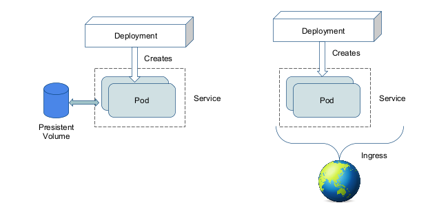
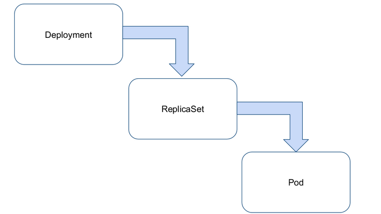

# Kubernetes Resources

So we learned before Kubernetes is a collection of resources. These resources are defined in a `spec` written in YAML files. The YAML files are then send to the cluster. Then those resources are then managed by the cluster. In many cases resources will create new resources as needed. But no worries we'll learn more about that later.

How does a simple app look like in Kubernetes? This diagram tries to describe it:



You will see a lot of terms being used so let's go over them:

## Pod

We'll be starting from the very **lowest** level: the pod.

> **Pod**: a group of whales

This is often called the atom of Kubernetes. It is the smallest visible level of an application. But it is where everything runs.

A pod ss one or more containers, usually ONE. In case there are several we call these "sidecar containers", why would you use them? To add functionality to your main container. For example, you could have a sidecar container that does logging or monitoring.

All containers in a pod share one IP and one network. They have no isolation between them.
For this the rule us to host one pod per application (so don't even think about putting a webserver and a database in one pod)!

A pod will look something like this:

```yaml
apiVersion: v1
kind: Pod
metadata:
  name: my-pod
spec:
  containers:
    - name: nginx
      image: nginx:latest
      ports:
        - containerPort: 80
      volumeMounts:
        - name: my-volume
          mountPath: /data
  volumes:
    - name: my-volume
      persistentVolumeClaim:
        claimName: my-pvc
```

Popular parts of the pod are:

- `containers`: the containers that run in the pod
- `volumes`: the volumes that are mounted in the pod, either from secrets, configmaps or persistent volumes
- `initContainers`: containers that run before the main containers, used for example to deploy a database schema update
- `restartPolicy`: the policy for restarting the pod, can be `Always`, `OnFailure` or `Never`
- `nodeSelector`: the node selector for the pod, used to schedule the pod on a specific node or group of nodes

A list of all fields can be gotten with `kubectl explain pod.spec` or [the api documentation](https://kubernetes.io/docs/reference/generated/kubernetes-api/v1.24/#pod-v1-core).

Let's look at the pods running in our cluster:

```bash
$ kubectl get pods -n kube-system
NAME                                         READY   STATUS    RESTARTS   AGE
coredns-565d847f94-8wmbk                     1/1     Running   0          3h16m
coredns-565d847f94-dxz2j                     1/1     Running   0          3h16m
etcd-kind-control-plane                      1/1     Running   0          3h16m
kindnet-zlr76                                1/1     Running   0          3h16m
kube-apiserver-kind-control-plane            1/1     Running   0          3h16m
kube-controller-manager-kind-control-plane   1/1     Running   0          3h16m
kube-proxy-wrvkh                             1/1     Running   0          3h16m
kube-scheduler-kind-control-plane            1/1     Running   0          3h16m
```

**You wouldn’t want to work on atomic level right? We will never create pods ourselves!**

## Deployment

Deployments are what drive applications! When we want to host a container in Kubernetes we will most of the times be using a deployment.

What can Deployment do for us?

- They take care of updating
  - They will create a new set of pods (ReplicaSet), wait till they are started then delete the old ones
  - Should this fail it will automaticaly stop
  - This causes a rolling update **without downtime**
- They take care of scaling
  - We can ask to scale up or down the pods over multiple servers
- They recreate pods should a server crash (or we delete them so they restart)

```yaml
---
apiVersion: apps/v1
kind: Deployment
metadata:
  name: hello-world-deployment
  namespace: default
spec:
  selector:
    matchLabels:
      app: hello-world
  replicas: 1
  template:
    metadata:
      labels:
        app: hello-world
    spec: # this is our pod spec!
      containers:
        - name: nginx
          image: nginxdemos/hello
          ports:
            - containerPort: 80
              name: http # from now on we can use the name http to refer to this port
          livenessProbe: # checks if the server still works every 5 seconds
            httpGet:
              path: /
              port: http
            initialDelaySeconds: 5
            periodSeconds: 5
          readinessProbe: # checks if the server is ready to accept traffic
            httpGet:
              path: /
              port: http
            initialDelaySeconds: 2
```

Want to know what all these words mean? [https://kubernetes.io/docs/concepts/workloads/controllers/deployment/](https://kubernetes.io/docs/concepts/workloads/controllers/deployment/)

Let's try it out, save this config as `deployment.yaml` and run:

```bash
kubectl apply -f deployment.yaml
```

Let's check if it worked:

```bash
kubectl get deploy # deploy is short for deployment(s)
```

If all was okay you will see something like this:

```bash
NAME                     READY   UP-TO-DATE   AVAILABLE   AGE
hello-world-deployment   1/1     1            1           43s
```

Let's run a `kubectl describe deploy hello-world-deployment` to see more details:

```
Name:                   hello-world-deployment
Namespace:              default
CreationTimestamp:      Mon, 03 Oct 2022 13:51:21 +0200
Labels:                 <none>
Selector:               app=hello-world
Replicas:               1 desired | 1 updated | 1 total | 1 available | 0 unavailable
StrategyType:           RollingUpdate
MinReadySeconds:        0
RollingUpdateStrategy:  25% max unavailable, 25% max surge
Pod Template:
  Labels:  app=hello-world
  Containers:
   nginx:
    Image:        nginxdemos/hello
    Port:         80/TCP
    Host Port:    0/TCP
    Liveness:     http-get http://:http/ delay=5s timeout=1s period=5s #success=1 #failure=3
    Readiness:    http-get http://:http/ delay=2s timeout=1s period=10s #success=1 #failure=3
    Environment:  <none>
    Mounts:       <none>
  Volumes:        <none>
Conditions:
  Type           Status  Reason
  ----           ------  ------
  Available      True    MinimumReplicasAvailable
  Progressing    True    NewReplicaSetAvailable
OldReplicaSets:  <none>
NewReplicaSet:   hello-world-deployment-5dc7657797 (1/1 replicas created)
Events:
  Type    Reason             Age   From                   Message
  ----    ------             ----  ----                   -------
  Normal  ScalingReplicaSet  96s   deployment-controller  Scaled up replica set hello-world-deployment-5dc7657797 to 1
```

You can see it made a `ReplicaSet` which it named `hello-world-deployment-5dc7657797`.
Let's look into that using `kubectl describe rs hello-world-deployment-5dc7657797` (again `rs` is short for `replicaset` both work! Oh also the name on your machine will be different)

```
Name:           hello-world-deployment-5dc7657797
Namespace:      default
Selector:       app=hello-world,pod-template-hash=5dc7657797
Labels:         app=hello-world
                pod-template-hash=5dc7657797
Annotations:    deployment.kubernetes.io/desired-replicas: 1
                deployment.kubernetes.io/max-replicas: 2
                deployment.kubernetes.io/revision: 1
Controlled By:  Deployment/hello-world-deployment
Replicas:       1 current / 1 desired
Pods Status:    1 Running / 0 Waiting / 0 Succeeded / 0 Failed
Pod Template:
  Labels:  app=hello-world
           pod-template-hash=5dc7657797
  Containers:
   nginx:
    Image:        nginxdemos/hello
    Port:         80/TCP
    Host Port:    0/TCP
    Liveness:     http-get http://:http/ delay=5s timeout=1s period=5s #success=1 #failure=3
    Readiness:    http-get http://:http/ delay=2s timeout=1s period=10s #success=1 #failure=3
    Environment:  <none>
    Mounts:       <none>
  Volumes:        <none>
Events:
  Type    Reason            Age    From                   Message
  ----    ------            ----   ----                   -------
  Normal  SuccessfulCreate  3m49s  replicaset-controller  Created pod: hello-world-deployment-5dc7657797-wkdnd
```

We see this make a `pod`! Let's look at that using `kubectl describe pod hello-world-deployment-5dc7657797-wkdnd`

```
Name:         hello-world-deployment-5dc7657797-wkdnd
Namespace:    default
Priority:     0
Node:         kind-control-plane/172.20.0.2
Start Time:   Mon, 03 Oct 2022 13:51:21 +0200
Labels:       app=hello-world
              pod-template-hash=5dc7657797
Annotations:  <none>
Status:       Running
IP:           10.244.0.5
IPs:
  IP:           10.244.0.5
Controlled By:  ReplicaSet/hello-world-deployment-5dc7657797
Containers:
  nginx:
    Container ID:   containerd://d4c35c5f1278d967aab8358b4dee215eff4ca6be4e3952cfbd1a785a2d698c35
    Image:          nginxdemos/hello
    Image ID:       docker.io/nginxdemos/hello@sha256:224be382373facb075e5ed867f057e14f35132f91b7b59de132fbdee03dd140d
    Port:           80/TCP
    Host Port:      0/TCP
    State:          Running
      Started:      Mon, 03 Oct 2022 13:51:31 +0200
    Ready:          True
    Restart Count:  0
    Liveness:       http-get http://:http/ delay=5s timeout=1s period=5s #success=1 #failure=3
    Readiness:      http-get http://:http/ delay=2s timeout=1s period=10s #success=1 #failure=3
    Environment:    <none>
    Mounts:
      /var/run/secrets/kubernetes.io/serviceaccount from kube-api-access-4hkq6 (ro)
Conditions:
  Type              Status
  Initialized       True
  Ready             True
  ContainersReady   True
  PodScheduled      True
Volumes:
  kube-api-access-4hkq6:
    Type:                    Projected (a volume that contains injected data from multiple sources)
    TokenExpirationSeconds:  3607
    ConfigMapName:           kube-root-ca.crt
    ConfigMapOptional:       <nil>
    DownwardAPI:             true
QoS Class:                   BestEffort
Node-Selectors:              <none>
Tolerations:                 node.kubernetes.io/not-ready:NoExecute for 300s
                             node.kubernetes.io/unreachable:NoExecute for 300s
Events:
  Type    Reason     Age    From                         Message
  ----    ------     ----   ----                         -------
  Normal  Scheduled  4m31s  default-scheduler            Successfully assigned default/hello-world-deployment-5dc7657797-wkdnd to kind-control-plane
  Normal  Pulling    4m30s  kubelet, kind-control-plane  Pulling image "nginxdemos/hello"
  Normal  Pulled     4m21s  kubelet, kind-control-plane  Successfully pulled image "nginxdemos/hello" in 9.403020325s
  Normal  Created    4m21s  kubelet, kind-control-plane  Created container nginx
  Normal  Started    4m21s  kubelet, kind-control-plane  Started container nginx
```

:::tip
You can do this from Pod -> ReplicaSet -> Deployment by following the `Controlled By` field! This is what Kubernetes uses to track down it's chain of command
:::

A Deployment is a type of Kubernetes resource that creates underlying resources! This is a very common pattern in Kubernetes.

A deployment will create one `ReplicaSet` per update (to do rolling upgrade). A `ReplicaSet` is then responsible to creatre the `Pods` that are needed and scale them (thus the name). We rarely create `ReplicaSets` directly, we use `Deployments` instead.



Let's scale up a bit!

```
kubectl scale deployment hello-world-deployment --replicas=3
```

This is a shortcut to change the `replicas:` field in the `Deployment` resource. We can also do this by editing the resource directly.

```bash
$ kubectl get pods
NAME                                      READY   STATUS              RESTARTS   AGE
hello-world-deployment-5dc7657797-vddkc   0/1     ContainerCreating   0          2s
hello-world-deployment-5dc7657797-wkdnd   1/1     Running             0          37m
hello-world-deployment-5dc7657797-zbwd9   0/1     ContainerCreating   0          2s
```

Good now we got 3!

## Service

We got a deployment running and containers are running. But how do we access them? We need a `Service`!
What does a service do for you? It gets you an (internal) IP address that you can use to access your application. It also does load balancing for you! So if you have multiple pods, it will load balance between them (like those 3 we just made).
It also gets you an internal DNS entry `<name>.<namespace>.svc.cluster.local` that you can use to access your application from other pods (think databases). If you are working in the same namespace calling the service name as DNS name is enough!

There are 3 types of services:

- **ClusterIP**: This is the default type. It gives you an internal IP address that you can use to access your application from within the cluster.
- **NodePort**: It gives a random port that is accessible on the external IP of the node, it exposes it to the outside world. (it also creates a ClusterIP)
- **LoadBalancer**: It will create a load balancer in your cloud provider that you are using so you get an external IP address. (it also creates a ClusterIP)

```yaml
---
apiVersion: v1
kind: Service
metadata:
  name: hello-world-service
  namespace: default
spec:
  type: ClusterIP
  selector:
    app: hello-world
  ports:
    - protocol: TCP
      port: 80
      targetPort: http
```

Let's save this to a file called `service.yaml` and apply it!

```bash
kubectl apply -f service.yaml
```

```bash
$ kubectl get service
NAME                  TYPE        CLUSTER-IP    EXTERNAL-IP   PORT(S)   AGE
hello-world-service   ClusterIP   10.96.82.17   <none>        80/TCP    3s
kubernetes            ClusterIP   10.96.0.1     <none>        443/TCP   3h50m
```

We see we got the internal IP `10.96.82.17` assigned. But where does it point to? Let's check the endpoints!

```bash
$ kubectl get endpoints
NAME                  ENDPOINTS                                   AGE
hello-world-service   10.244.0.5:80,10.244.0.6:80,10.244.0.7:80   82s
kubernetes            172.20.0.2:6443                             3h51m
```

Just like Deployment created ReplicaSets, Services create Endpoints. Endpoints are just a list of IP addresses and ports that the service points to. In this case, it points to the 3 pods that we have running. If we scale up the deployment, the endpoints will be updated automatically.

Let's try to access it! For now it is only accessible from within the cluster. We can do this by using `kubectl port-forward` to forward a local port to the service.

```bash
kubectl port-forward service/hello-world-service 8080:80
```

This will forward port 8080 on your local machine to port 80 on the service. However it is not actually loadbalancing as this is a **debug** feature.

Let's quickly set up a **debud pod** for us to play in:

```bash
kubectl run -i -t test-alpine --image=alpine --restart=Never
```

Let's use `curl` to access the service from within the cluster:

```bash
apk add curl
curl http://hello-world-service.default.svc.cluster.local
```

When you're done exit the pod and please clean up the mess you made:

```bash
kubectl delete pod test-alpine
```

Do the curl command a few times you will notice you get an answer from a different pod out of our 3 each time.

## Ingress

An Ingress is an important part of the average Kubernetes setup. It will be loadbalancing HTTP(S) for you. It also does virtualhosting based routing! By default Kubernetes supports path and host based routing (port bases is called a NodePort Service).

The Ingress is often also responsible for terminating TLS connections for HTTPS and will be keeping certificates for you. This usally happens here as the overlay network is often encrypted by default.


_Eyskens, M. (2018, April 18). Building a Kubernetes Ingress controller · https://eyskens.me/building-a-kubernetes-ingress-controller/_

While being important it does not ship by default in Kubernetes. You need to install an Ingress Controller. There are a few options:

- [NGINX Ingress Controller by Kubernetes](https://kubernetes.github.io/ingress-nginx/)
- [NGINX Ingress Controller by NGINX inc (an F5 company)](https://www.nginx.com/products/nginx/kubernetes-ingress-controller/)
- [Traefik](https://doc.traefik.io/traefik/providers/kubernetes-ingress/)
- [HAProxy](https://haproxy-ingress.github.io/)
- [Contour](https://projectcontour.io/)
- [Skipper by Zalando](https://opensource.zalando.com/skipper/kubernetes/ingress-controller/)

_In this tutorial I will be assufing you are using the NGINX Ingress Controller by Kubernetes as it is supported by the Kubernetes Community. For installation see [Clusters](../clusters/)_

```yaml
---
apiVersion: networking.k8s.io/v1
kind: Ingress
metadata:
  name: hello-world-ingress
  namespace: default
spec:
  rules:
    - host: hello-world.local
      http:
        paths:
          - path: /
            pathType: Prefix
            backend:
              service:
                name: hello-world-service
                port:
                  name: http
```

:::tip
Not a fan of `/etc/hosts`, [messwithdns.net](https://messwithdns.net/) is a great tool to quickly get a DNS entry on the interwebs.
:::

Let's save this to a file called `ingress.yaml` and apply it!

```bash
kubectl apply -f ingress.yaml
```

Let's quickly cheat with DNS:

```bash
echo "127.0.0.1 hello-world.local" | sudo tee -a /etc/hosts
curl http://hello-world.local
```

You will now see the same hello-world page as before! But this time it is linked to a domain name, while still being loadbalanced as before!

:::tip
In production you probably want a proper HTTPS certificate. [cert-manager](https://cert-manager.io/docs/tutorials/acme/nginx-ingress/) is your friend to request one from Let's Encrypt using a few lines of YAML. (yes the author of this chapter is biased but it really is the best)
:::

## Other interesting resources

The above three are great to get started but there are many more to look into for building acually useful applications!
The Kubernetes documentation is a great place to start:

- [ConfigMap](https://kubernetes.io/docs/concepts/configuration/configmap/) - for mounting configuration files into containers
- [Secret](https://kubernetes.io/docs/concepts/configuration/secret/) - for mounting secrets into containers
- [CronJob](https://kubernetes.io/docs/concepts/workloads/controllers/cron-jobs/) - for running scheduled jobs
- [DaemonSet](https://kubernetes.io/docs/concepts/workloads/controllers/daemonset/) - for running a pod on every node
- [PresistentVolumeClaim](https://kubernetes.io/docs/concepts/storage/persistent-volumes/) - for requesting persistent storage to be added into containers

## Wordpress on Kubernetes - a tutorial

Are you ready to sail the wild seas of the Kubernetes? Let's get started!
This tutorial combines both the use of [Helm](../helm/) (so read up on that first!) charts as well as working with our own YAML manifests.

### The Big Picture

We're going to use Wordpress as an example here, Wordpress needs a storage volume and a MySQL database.
Since managing databases is a solved issue we will be using a [Helm Chart](https://artifacthub.io/packages/helm/bitnami/mysql) to assist us here.
We will also need a volume to host our user uploads to our wordpress container.

```

 ----------         --------
(          )       |        |
(          )       |        |
(  Volume  )  ---> |  MySql |
(          )       |        |
(          )       |        |
 ----------         --------

                        |
                        | ClusterIP Service
                        |
                        v
----------         --------
(          )       |        |       @@@@@@@@@@@
(          )       |        |       @         @
(  Volume  )  ---> |   WP   |  ---> @ Ingress @ ---> User
(          )       |        |       @         @
(          )       |        |       @@@@@@@@@@@
 ----------         --------

```

### MySQL

Let's start by our database! By looking at [artifacthub.io/packages/helm/bitnami/mysql](https://artifacthub.io/packages/helm/bitnami/mysql]) we learn a lot of options we can use to configure this.
We can write our own `values.yaml` file to set all these but using `--set` for now is shorter.

:::tip
Bitnami (a VMWare company) is a big publisher of Helm Charts however they use their own images which will not yet work on `arm64`. If you need ARM based images you might want to try this [MariaDB Chart](https://artifacthub.io/packages/helm/nicholaswilde/mariadb)
:::

```bash
helm repo add bitnami https://charts.bitnami.com/bitnami
helm install wp-mysql bitnami/mysql --set auth.password=random --set auth.username=wp --set auth.database=wp
```

This will have installed everything our MySQL will need.

Let's look at what it has done!

```bash
kubectl get pod
NAME         READY   STATUS    RESTARTS   AGE
wp-mysql-0   1/1     Running   0          86s
```

We see we have one MySQL container running. But we also needed a service right?

```dns
$ kubectl get service
NAME                  TYPE        CLUSTER-IP     EXTERNAL-IP   PORT(S)    AGE
wp-mysql              ClusterIP   10.96.17.79    <none>        3306/TCP   2m12s
wp-mysql-headless     ClusterIP   None           <none>        3306/TCP   2m12s
```

We see we have a `wp-mysql` service, which has an IP! The IP here can change and is only showed for information. Kubernetes also sets up DNS for us (yay!) so we can just call it using `wp-mysql` as hostname later (in the same namespace).

But wait where does it store data?

```bash
$ kubectl get pvc
NAME              STATUS   VOLUME                                     CAPACITY   ACCESS MODES   STORAGECLASS   AGE
data-wp-mysql-0   Bound    pvc-19f8e65f-81be-4436-916c-2672f486199c   8Gi        RWO            standard       3m46s
```

PVC stands for Presistent Volume Claim and will get us a request for storage, minikube and kind will make some space on our local HDD. If you use Kubernetes in the cloud Kubernetes will actually order storage with your cloud provider for you! (on-premis you have to set something up yourself)

At last we also have secrets! These are stored securely by Kubernetes and can be injected into other resources, here passwords are stored for example.

```bash
$ kubectl get secret
NAME                             TYPE                                  DATA   AGE
default-token-5g8dv              kubernetes.io/service-account-token   3      3s
sh.helm.release.v1.wp-mysql.v1   helm.sh/release.v1                    1      4s
wp-mysql                         Opaque                                2      4s
wp-mysql-token-74pxj             kubernetes.io/service-account-token   3      4s
```

We see that Helm amd Kubernetes themselves like to use secrets also! We are interested in the `wp-mysql` our Helm Chart created.

This command doesn't tell us much about `wp-mysql`, so let's use another one.

```bash
$ k describe secret wp-mysql
Name:         wp-mysql
Namespace:    default
Labels:       app.kubernetes.io/instance=wp-mysql
              app.kubernetes.io/managed-by=Helm
              app.kubernetes.io/name=mysql
              helm.sh/chart=mysql-8.2.3
Annotations:  <none>

Type:  Opaque

Data
====
mysql-password:       6 bytes
mysql-root-password:  10 bytes
```

We now know we have 2 data keys, these keys we can use later to get the data we want!

:::tip
Need the password? `kubectl get secret wp-mysql -o jsonpath="{.data.mysql-password}" | base64 --decode`
Secrets are only encrypted at rest, you can easily get the data out of them! However they are base64 encoded (base64 is not encryption).
:::

Our MySQL is now ready! Thanks to Helm we don't have to care too much about it, the experts who made the Helm Chart already put in years of expertise into making magic.

### Wordpress

MySQL was easy (no?)! There is also a Wordpress Helm Chart! But if you walk into a job where you just got hired to work on a Kubernetes cluster you probably won't find a Helm chart there. So let's do this by hand!

If you remember our over simplistic schematic from before we need storage.
Let's make a folder somewhere on your disk to make these YAML files, you always want to keep the YAML you write to be saved somewhere, so you can quickly restore on case of a cluster failure!

Copy the following code into `pvc.yaml` (or any other name you like more)

```yaml
apiVersion: v1
kind: PersistentVolumeClaim
metadata:
  name: wp-persistent-storage # the name of our PVC
spec:
  accessModes:
    - ReadWriteOnce # This tells how many users can read/write or if it needs to be read only
  resources:
    requests:
      storage: 6Gi # how much storage we want
```

Now we need to apply it. You have 2 options:

```bash
kubectl create -f pvc.yaml
```

or

```bash
kubectl apply -f pvc.yaml
```

`kubectl create` will hard error if you already have the resources in your cluster, `kubectl apply` will try to update the resources if it finds them, the 2nd option is better if you want to fix anything you applied before. The first one however safeguards you against removing things if you named them the same by accident.

Let's see what we have created, shall we?

```bash
$ kubectl get pvc
NAME                    STATUS    VOLUME                                     CAPACITY   ACCESS MODES   STORAGECLASS   AGE
data-wp-mysql-0         Bound     pvc-29cf2c86-2091-4f05-87ac-51dfa83c0dfb   8Gi        RWO            standard       30m
wp-persistent-storage   Pending                                                                        standard       11s
```

Pending? huh... `kubectl describe` to the rescue!

```bash
$ kubectl describe pvc wp-persistent-storage
Name:          wp-persistent-storage
Namespace:     default
StorageClass:  standard
Status:        Pending
Volume:
Labels:        <none>
Annotations:   <none>
Finalizers:    [kubernetes.io/pvc-protection]
Capacity:
Access Modes:
VolumeMode:    Filesystem
Mounted By:    <none>
Events:
  Type    Reason                Age                From                         Message
  ----    ------                ----               ----                         -------
  Normal  WaitForFirstConsumer  15s (x7 over 92s)  persistentvolume-controller  waiting for first consumer to be created before binding
```

The `Events` section of the describe gives us recent updates on what is happening with our resources, Kubernetes here logs what it is doing with it.
`waiting for first consumer to be created before binding` is our error, Kubernetes is just waiting on us using the volume somewhere!

So let's use it!
Our Deployment is our component that will create all our pods for us. This time we have quite a long one!
We now do a lot more, we tell Kubernetes to add secret data into our containers via [environment variables](https://en.wikipedia.org/wiki/Environment_variable) a common practice in containers.
It also will mount a volume to the container! Thanks to Kubernetes talking to your cloud provider in reality it can migrate the volume between physical servers for you :)

Let's create `deployment.yaml`, we do a lot here so make sure to read the comments so you know what we are doing.

```yaml
apiVersion: apps/v1
kind: Deployment
metadata:
  name: wordpress
  labels:
    app: wordpress
spec:
  selector: # the selector is for the deployment to know which pod's it owns, make sure to keep labels the same everywhere
    matchLabels:
      app: wordpress
  template:
    metadata:
      labels:
        app: wordpress
    spec:
      containers:
        - image: wordpress:apache # we pull wordpress from hub.docker.com, `apache` is our tag meaning we pull that specific version, for WP this means the latest version with apache server built in
          imagePullPolicy: Always # this will alwatch check for a newer image when a pod stars, you can also set it to IfNotPresent so it only downloads it if not on disk already
          name: wordpress # name of the container, only used for you to know what is running
          env: # set environment variables
            - name: WORDPRESS_DB_HOST # equivalent to `export WORDPRESS_DB_HOST=wp-mysql`
              value: wp-mysql # this is our service name from before! Kubernetes will automatically set up internal DNS to resolve service names to cluster IPs
            - name: WORDPRESS_DB_USER
              value: wp
            - name: WORDPRESS_DB_NAME
              value: wp
            - name: WORDPRESS_DB_PASSWORD
              valueFrom: # we can specify values by hand as above, or get them from secrets!
                secretKeyRef:
                  name: wp-mysql
                  key: mysql-password
          ports:
            - containerPort: 80 # this gives the port 80 the name wordpress, it does not expose it to the outside world yet
              name: wordpress
          volumeMounts: #this part tells to mount the `wp-persistent-storage` to `/var/www/html`
            - name: wp-persistent-storage
              mountPath: "/var/www/html"
      volumes:
        - name: wp-persistent-storage # this is the actual definition of the `wp-persistent-storage` volume to tell it which PVC to use
          persistentVolumeClaim:
            claimName: wp-persistent-storage
```

Deploying this will take a few seconds as it will create the container and the volume. You can watch it setting up everything using `kubectl get pod` or `kubectl describe pod <pod name>` in more detail!
Tip: `kubectl describe pod -l app=wordpress` describes all pods with the label `app=wordpress`

Now we see it running and ready we have Wordpress running on Kubernetes and talking to our MySQL. Now we need to expose it to the "internet".

Let's create `service.yaml`:

```yaml
apiVersion: v1
kind: Service
metadata:
  name: wordpress
  labels:
    app: wordpress
spec:
  type: ClusterIP
  ports:
    - protocol: TCP
      port: 80 # port on the service IP
      targetPort: wordpress # port on the container, can also be a number
      name: wordpress
  selector:
    app: wordpress
```

Now we have a service for our Wordpress install.
We are now going to expose it with our Ingress:
Let's create `ingress.yaml`

```yaml
---
apiVersion: networking.k8s.io/v1
kind: Ingress
metadata:
  name: wordpress
  labels:
    app: wordpress
spec:
  rules:
    - host: wordpress.local
      http:
        paths:
          - path: /
            pathType: Prefix
            backend:
              service:
                name: wordpress
                port:
                  name: wordpress
```

Now let's look at it,:

```bash
$ kubectl get ingress
NAME                HOSTS       ADDRESS           PORTS   AGE
wordpress-ingress   localhost   192.168.122.158   80      19m
```

To have more fun we could forward the domain to our server IP on our own machine:

- Windows: https://www.thewindowsclub.com/hosts-file-in-windows
- macOS: https://www.alphr.com/edit-hosts-file-mac-os-x/
- Linux: _do i really have to tell you?..._ okay here it is: https://www.makeuseof.com/tag/modify-manage-hosts-file-linux/

If all goes right you can now open `wordpress.local` in your browser and enjoy wordpress!

## The End!

Congratulations you just make your first steps into the world of Kubernetes! There is a lot more to explore on these seas but this small introduction should help you to explore!
