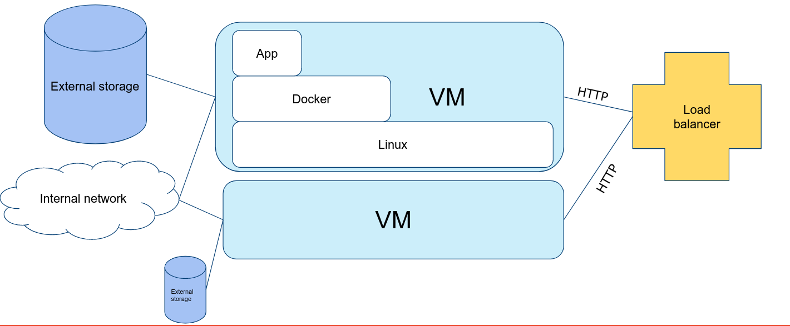
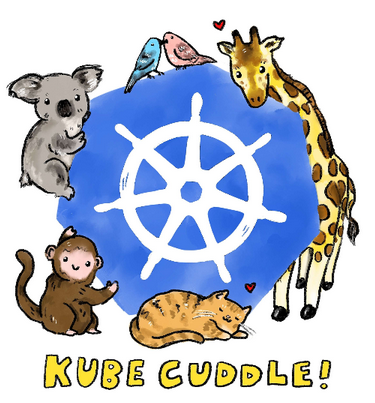

# Kubernetes

## Glossary

- **Kubernetes**: Greek for captain, pilot
- **k8s**: hacker talk for Kubernetes, [8 characters between k and s](https://twitter.com/lunasorcery/status/1278984875190689798)
- **pod**: a group of whales
- **Helm**: steering wheel of a boat

## In the beginning...

Kubernetes was started as a side project by Joe Beda, Brendan Burns, and Craig McLuckie while working at Google. It was originally planned to be an improved version of Borg, the system that manages (still does) Google's infrastructure, a lot of ideas came from that system.  
They filled in gaps that the current upcoming Docker did "wrong", they focussed on multi-server deploys on large scales where for Docker this was an afterthought.

In 2015 Kubernetes 1.0 was released and Google worked with the Linux foundation to found a new organisation the CNCF (Cloud Native Computing Foundation) to maintain Kubernetes and other projects onwards. While Kubernetes didn't make it into the core Google infrastructure, it did become a big part of Google Cloud Platform in the form of GKE (Google Kubernetes Engine), a widely used GCP service. Many big companies joined in support of the CNCF, including Microsoft, IBM, Red Hat, Amazon, and many more. Making Kubernetes a meeting place of all competing cloud and Linux companies working together.

Kubernetes quickly became used in medium to big companies to deploy containers as it solved a few pain points Docker (and later Docker's multi-server attempt Swarm) had:

- Storage using automatic network attached storage
- Inter container networking using an "overlay network"
- Automatic load balancing & rolling updates
- Automatic scaling
- Muli-server deploys

But maybe one of the most important feature is that it solved a pain point of the cloud. Many cloud systems offered these services but they all were different.
Because Kubernetes had a big community it provides a **standard API** to deploy containers, making it easy to switch between cloud providers or exchange configurations. Kubernetes abstracts many things the cloud provider does for us away into standard definitions (well... tries to...).

## What is Kubernetes?

Well..Kubernetes doesn’t exist...

> "Kubernetes is the new Linux"

Just like Linux is a name we give to a whole OS while it is just the tiny base the same is true for Kunernetes!
Kubernetes are many moving parts combined together. Kubernetes also has distros just like Linux.
These distributions come with a few pre-installed components. Kubernetes provides an API to the end user for common tasks that are involved with large application deployments. But underneath it gets help from a container engine, a storage system, an overlay networking system, etc.
Other things are then done by Kubernetes itself... like scheduling, load balancing, scaling, etc. Let's not get too deep into that for now... We'll guide you through the basics of using Kubernetes!

Let's look at some typical cloud setup: (hint: doesn't this look like a simpler version of the image we open every class with??)


We see that we have multiple machines to loadbalance under, we have an internal network and storage. We run all our apps in Docker containers here. If you had to set this all up yourself you would have to do a lot of work. But Kubernetes does this for you! Further ahead we will compare this to what it is in Kubernetes.

### Distros

In need of a Kubernetes distro? It comes in many flavours! Some are bound to a specific cloud platform, others you can self host.

Some Kubernetes distros come with the basics and leave the rest to the user to install. Others are ready out of the box with many components installed, while this sounds easy it leaves not much freedom to chose your tooling of leave out parts you do not use which slow down deployment.

**Cloud:**

All the big cloud providers offer Kubernetes as a service which are tied into the cloud platform for loadbalancing, storage etc.

- [Google Kubernetes Engine](https://cloud.google.com/kubernetes-engine)
- [Amazon Elastic Kubernetes Service](https://aws.amazon.com/eks/)
- [Azure Kubernetes Service](https://azure.microsoft.com/en-us/services/kubernetes-service/)
- [DigitalOcean Kubernetes](https://www.digitalocean.com/products/kubernetes/)
- [Oracle Container Engine for Kubernetes](https://www.oracle.com/cloud/compute/container-engine-kubernetes.html)
- [Linode Kubernetes Engine](https://www.linode.com/products/kubernetes/)
- [IBM Cloud Kubernetes Service](https://www.ibm.com/cloud/container-service)

and many more...

**On-premise/Self-Hosted:**

You can self-host Kubernetes on premise. Some companies prefer to also self-host in the cloud to have full control over the setup where a cloud offered managed Kubernetes locks you out of the deep inner workings.

- [Kubeadm](https://kubernetes.io/docs/setup/production-environment/tools/kubeadm/install-kubeadm/) - open source and supported by the CNCF
- [Typhoon](https://typhoon.psdn.io/)
- [Kubespray](https://kubespray.io/#/)
- [Kubermatic](https://www.loodse.com/)
- [Kublr](https://www.kublr.com/)
- [VMWare Tanzu](https://tanzu.vmware.com/)
- [RedHat OpenShift](https://www.openshift.com/)
- [K3s](https://k3s.io/) - Technicaly a fork of Kubernetes

**Development (local):**

When working on a local machine for testing and deployment we have a few options, most of them are however limited to a single server and should not be used in production.

- [kind](https://kind.sigs.k8s.io/) (Kubernetes in Docker) - open source and supported by the CNCF
- [Minikube](https://minikube.sigs.k8s.io/docs/start/) - open source and supported by the CNCF
- [MicroK8s](https://microk8s.io/)
- [Docker Desktop](https://www.docker.com/products/docker-desktop)
- [CRC](https://developers.redhat.com/products/codeready-containers/overview) (for OpenShift)

## Working with Kubernetes

Now we kind of know what Kubernetes is we can get to work! Want to try it all out already just jump ahead to [Clusters](../clusters/) to set up your local kind cluster.

But first we have to know how to work with Kubernetes! For this we will learn how to use the CLI tool `kubectl` and take a look on how resources/configurations/... are defined in Kubernetes.

**Is there no GUI?** Yes... but do not use it. The Kubernetes Dashboard is not well maintained (lacks many features) and often is a nice way to hack into your cluster when exposed on the internet. We also cannot automate things with it like we would do in a CI/CD deployment. So we will not use it.

### `kubectl`

Before we get to look at what is inside Kubernetes we have to learn how to access it all.
We have the command line utility `kubectl` which is the main way to interact with Kubernetes. It is a CLI tool that can be used to deploy, manage, and debug applications in a Kubernetes cluster. It is the main tool for interacting with Kubernetes and is used to deploy and manage applications.

How it is pronounced is [a mystery](https://www.youtube.com/watch?v=2wgAIvXpJqU)... Let's just stick with `cube cee-tee-el` or `cube control` for now...


_(my favorite “mis”pronounciation is kube cuddle)_

kubectl can is a tool create/delete/update everything in Kubernetes. But it does more that that!

```bash
kubectl create -f file.yaml # create a resource from a file definition

kubectl apply -f file.yaml # create or updates (if exists!) a resource from a file definition

kubectl delete <resource type> <name> # delete a resource

kubectl get <resource type> # get a list of resources of a certain type
```

Let's try some out:

```bash
kubectl get pods # get a list of all pods
kubectl get nodes # get a list of all nodes
kubectl get services # get a list of all services
```

But it can also understand you Kubernetes better!

```bash
kubectl explain <resource type> # get a list of all resources of a certain type
kubectl describe <resource type> <name> # explains everything about a specific resource in your cluster
```

Let's try looking at some explain commands:

```bash
kubectl explain pod
kubectl explain node
```

A quick browse in the documentation also gets you into the **helper commands**:

```bash
kubectl run <name> --image=<image> # create a pod with a container running an image
```

This creates a pod with an image. **Howerver it leaves no replicatable configuration, it should only be used for testing**.
What we want is a collection of configuration what is running in the cluster (preferably in a Git repo). So we know what exactly is running and that we can re-deploy in case of failure. Tools like [AgroCD](https://argo-cd.readthedocs.io/en/stable/) can even automate this proccess when linked to a Git repo.

### What's in a YAML?

Everything in Kubernetes is resource. A resource is like an object in a programming language. It has a type, a name and some properties.
We write these down in YAML files.

Let's take a look at the typical structure Kubernetes uses:

```yaml
apiVersion: v1
kind: Pod
metadata:
  name: my-application
  labels:
    app: company-website-app
spec:
  containers:
    - name: webserver
      image: mycompany/webserver:v1.0.0
```

- `apiVersion` - The version of the Kubernetes API you are using to create this object.
  - This is a required field
  - often you will see `v1` which means it is the CORE API
    - `apps/v1`, `extensions/v1beta1`, `networking.k8s.io/v1` are all other APIs depekding on their work domain
    - some resources are not yet stable so you might see `v1alpha1` or `v1beta1` or alike.
- `kind` - is the type of resource it is within the API version
- `metadata` - is data that helps uniquely identify the resource, including a name, multiple labels, and optional namespace.
- `spec` - is the specification of the desired behavior of the resource, this contains all configuration for the resource.

This format is used for all resources in Kubernetes. So we can use the same format for a Pod, Deployment, Service, Ingress, ... and so on even third-party resourced (called Custom Resources) an add-on may bring.

An exception in this is `status`, you will find it when you ask back a resource from Kubernetes. It is technically a "sub-resource" of the resource and contains information about the current state of the resource.

```yaml
apiVersion: v1
kind: Pod
[...]
status:
  conditions:
    lastTransitionTime: "2022-10-03T08:43:55Z"
    status: "True"
    type: Ready
  containerStatuses:
  - containerID: containerd://d8378faef614be496ba8e2ab92f2f1836795f7eebd7b7dd5c5099f7ed83364b5
    image: docker.io/kindest/kindnetd:v20220726-ed811e41
    imageID: sha256:d921cee8494827575ce8b9cc6cf7dae988b6378ce3f62217bf430467916529b9
    lastState: {}
    name: kindnet-cni
    ready: true
    restartCount: 0
    started: true
    state:
      running:
        startedAt: "2022-10-03T08:43:55Z"
  hostIP: 172.20.0.2
  phase: Running
  podIP: 172.20.0.2
  podIPs:
  - ip: 172.20.0.2
  qosClass: Guaranteed
  startTime: "2022-10-03T08:43:53Z"
```

You'll never set this by hand but the system itself will update it. It is a way for Kubernetes to keep track of the current state of the resource.

:::tip
You can always get the YAML spec of a resource by using the `kubectl get <resource type> <name> -o yaml` command.
:::

#### Intermezzo: labels


_Labels, or name tags is how they are presented in the [Children's Guide to Kubernetes](https://www.cncf.io/phippy/) ([also in video](https://www.youtube.com/watch?v=4ht22ReBjno))_

In Kubernetes we have diffetent kind of resources that belong together. It could be multiple containers, or a service which has to find which pods to route to. We can use labels to group these resources together.

```yaml
metadata:
  name: my-application
  labels:
    app: company-website-app
    department: marketing
    release: stable
    version: 1.0.0
```

While this tells us more about the resource, it also allows us to select resources based on these labels.

```bash
kubectl get pods -l release=stable # get all pods with the label release=stable
```

Labels are also passed on into resources Kubernetes creates for us.

They are often used in **Label Selectors** to find resources. For example, a Service can use a label selector to find the Pods it should route to.

```yaml
apiVersion: v1
kind: Service
metadata:
  name: my-application
spec:
    selector:
        app: company-website-app
        release: stable
    ports:
        - protocol: TCP
        port: 80
        targetPort: 80
```

This will make sure the service links to the app `company-website-app` with the label release version `stable`.

### Kubernetes Magic?

We have a spec written in YAML, we can use `kubectl` to create it in our cluster. But how does Kubernetes know what to do with it?
This is s a process called **reconciling**.

Kubernetes will reconcile until reality matches
the spec.

### Pods

Objects can also be generated/updated
by Kubernetes

API Objects have the following common fields:

Metadata: The name and namespace

Spec: The desired state of an object

Status: The current state of an object

Pod: a group of whales

Is one or more containers, usually ONE

Containers share one IP, one network

Can look at each other's disk, processes etc.

Smallest unit in Kubernetes (like atoms)

One pod per application!

You wouldn’t want to work on atomic level right?

Deployments: drive applications!

They take care of updating

They take care of scaling

They recreate pods should a server crash

You define the spec, k8s will make it happen

apiVersion: apps/v1

kind: Deployment

metadata:

name: nginx-deployment

labels:

app: nginx

spec:

replicas: 3

selector:

matchLabels:

app: nginx

template:

metadata:

labels:

app: nginx

spec:

containers:

- name: nginx

image: nginx:1.14.2

ports:

- containerPort: 80

How to talk Kubernetes

## Namespaces

Namespace

#

Isolation

A security boundary

```bash
kubectl create <namespace>

kubectl -n <namespace>
```

default one: “default”

example: system services “kube-system”

Writing all that YAML for everything? No you silly!

#

Helm!

Your package manager for Kubernetes

https://artifacthub.io/ offers 2548 apps

https://artifacthub.io/packages/helm/bitnami/
mysql

Helm “charts”: allow configurable YAML, also for
YOUR apps :D
